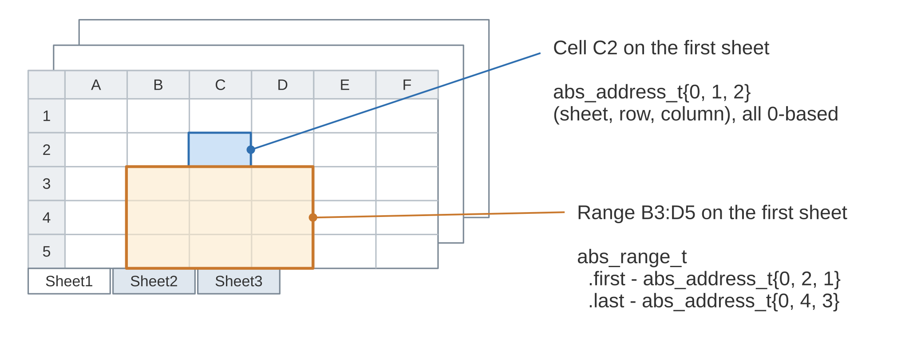
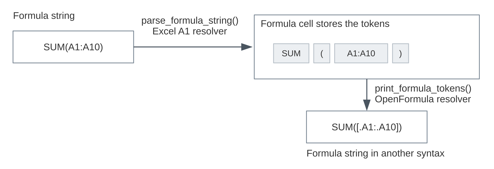
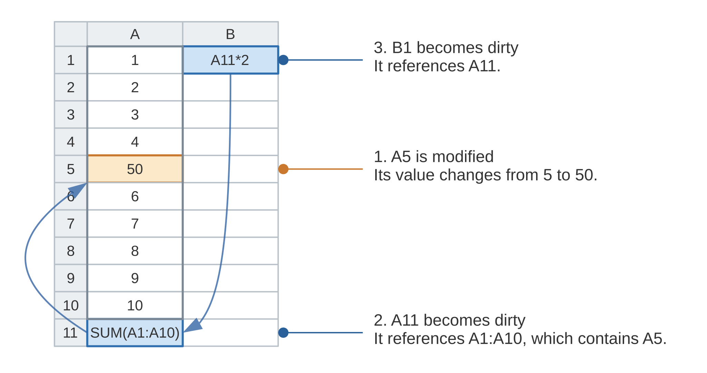
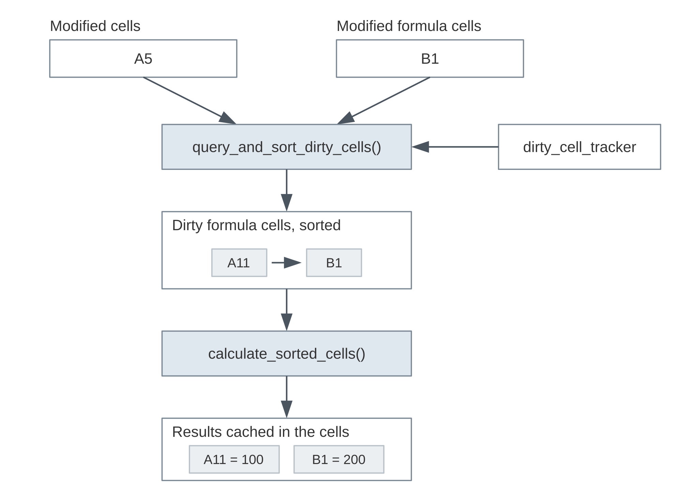
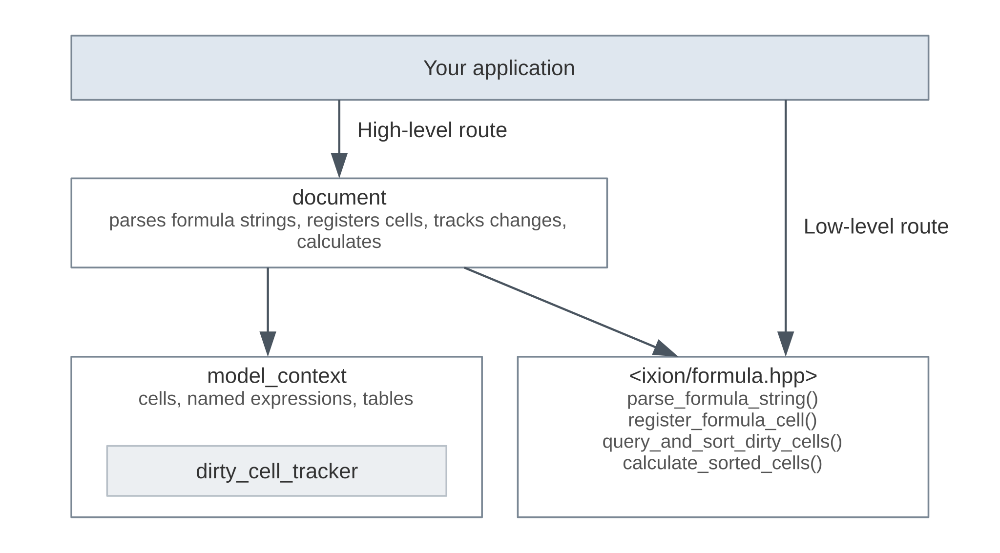

.. highlight:: cpp

.. _concepts:

Concepts
========

Before diving into code, it helps to know what the main pieces of Ixion are
and how they relate to each other.  This page gives you that picture.  The
pages that follow then walk through the same ideas with working examples.

Cells and sheets
----------------

All cell values live in a :cpp:class:`~ixion::model_context`.  A model
context holds one or more sheets of a fixed size, each being a
two-dimensional grid of cells.  A cell can be empty, or it can hold a
numeric, boolean, string or formula value.

To point at a cell you use an :cpp:struct:`~ixion::abs_address_t`, which is
just a sheet index, a row index and a column index, all 0-based.  A
rectangular block of cells is an :cpp:struct:`~ixion::abs_range_t`.  You
append sheets by name, and the index of a sheet is simply its position in
the model.

         on the first sheet picked out with their addresses.

   A model context with three sheets.  C2 on the first sheet is the
   address ``{0, 1, 2}``, and B3:D5 is the range from ``{0, 2, 1}`` to
   ``{0, 4, 3}``.

The model context is deliberately kept small.  It holds only what the
formula engine needs in order to run a full calculation: the cell values,
the formula cells, and the named expressions and tables that formulas refer
to.  Anything beyond that, such as keeping track of which cells you have
edited since the last calculation, is left to whoever uses the model context,
be it the :cpp:class:`~ixion::document` class or your own program.

In the same spirit, the model context doesn't calculate anything by itself.
Something outside of it has to drive the calculation, and that something is
either your own code calling the functions described below, or the
:cpp:class:`~ixion::document` class we'll get to at the end of this page.

Formulas are tokens
-------------------

Ixion doesn't keep formulas around as strings.  When you hand it a formula
string like ``SUM(A1:A10)``, it gets parsed once into a sequence of tokens of
type :cpp:type:`~ixion::formula_tokens_t`, and those tokens are what the
formula cell stores and what the interpreter runs at calculation time.

         printed back out as a string in another syntax.

   The round trip of a formula.  The string is parsed with one resolver
   into tokens, and the tokens can be printed back with the same or
   another resolver.

To parse a formula you need a :cpp:class:`~ixion::formula_name_resolver`.
When the parser splits a formula string apart, some pieces are easy to
classify on their own: operators, numbers and quoted strings.  Everything
else, like ``A1``, ``Sheet1!B2:C5``, ``SUM`` or ``Total``, is a *name*, and
what a name stands for depends on the syntax the formula is written in.

The resolver's main job is to make sense of those names, that is, to decide
whether each one is a cell reference, a range reference, a table reference,
a named expression or a function.  Along the way it also handles the finer
points of the syntax, such as how a sheet name is attached to a reference,
how absolute rows and columns are marked, and how a range is written.  Ixion
comes with resolvers for the following syntaxes, and you pick one with a
:cpp:enum:`~ixion::formula_name_resolver_t` value:

* Excel A1
* Excel R1C1
* LibreOffice Calc A1
* OpenFormula
* ODF cell-range-address

The :ref:`formula-syntax` page goes through these in detail.

The resolver also works in the other direction, turning tokens back into a
string through :cpp:func:`~ixion::print_formula_tokens`.  Since the tokens
themselves don't depend on any particular syntax, you can parse a formula
with one resolver and print it with another.

One more thing to keep in mind: a reference can be relative or absolute.  An
absolute reference such as ``$A$1`` always points at the same cell, whereas a
relative reference such as ``A1`` stores its target as an offset from the
cell the formula is in, so the same tokens point at different cells
depending on where the formula lives.  That's why both
:cpp:func:`~ixion::parse_formula_string` and
:cpp:func:`~ixion::print_formula_tokens` ask for the position of the formula
cell.

Dependency tracking
-------------------

Every model context comes with a :cpp:class:`~ixion::dirty_cell_tracker`.  Its
job is to remember which cells each formula cell references, so that when a
cell changes, we can find the formula cells that depend on it, either directly
or indirectly.

         makes A11 dirty, and A11 in turn makes B1 dirty.

   A11 references A1:A10 and B1 references A11.  When A5 changes, the
   tracker reports A11 as dirty, and through it B1.

The model keeps the tracker up to date on its own.  When you set a formula
cell, it walks through the reference tokens of the formula and records each
one; when you overwrite or empty a formula cell, it drops the old references.

A formula cell whose result needs to be re-calculated is said to be *dirty*.
That happens when one of the cells it references has changed, either
directly or through some other formula cell in between, or when the formula
cell itself is new or has been modified.  A formula cell that uses a
*volatile* function such as ``NOW()`` is treated as dirty on every
calculation.  See :ref:`errors-and-volatile`.

.. note::

    The references get recorded at the moment you set the formula cell, so a
    named expression or table the formula refers to has to exist by then.
    When you bulk-load a model, :cpp:class:`~ixion::model_context_loader`
    records the references once everything is in, so the order the content
    comes in matters less.  See :ref:`model-context-loader`.

Calculation
-----------

Calculation is a two-step process.  First you tell the model which cells have
been modified since the last calculation and ask for the dirty formula cells
via :cpp:func:`~ixion::query_and_sort_dirty_cells`.  What you get back is
the positions of those formula cells, sorted in order of dependency so that
each one comes after the cells it depends on.  Then you hand that sorted
sequence to
:cpp:func:`~ixion::calculate_sorted_cells`, which interprets the formula
cells one by one in that order and stores each result in its cell.

         tracker and yields the dirty formula cells in dependency order;
         those go through the calculation and end up as cached results.

   The two steps of a calculation.  The modified cells and the modified
   formula cells go in, the dirty formula cells come out sorted, and the
   calculation stores a result in each of them.

.. note::

    You may wonder why the sequence consists of cell ranges rather than
    individual cell positions.  That's because of formula groups, which
    we'll come back to at the end of this page.  The cells of a group are
    calculated as one unit, so a dirty group shows up in the sequence as a
    single range covering all of its cells, while an ordinary formula cell
    shows up as a range of just one cell.

For the very first calculation you can simply declare every cell modified,
which makes every formula cell dirty.  From then on you only pass in what
actually changed, and only the formula cells affected by those changes get
re-calculated.

:cpp:func:`~ixion::calculate_sorted_cells` also takes a thread count.  Pass
zero and everything runs on the calling thread.  Pass a positive number and
that many calculation threads get spawned; a formula cell that needs a result
still being computed on another thread simply waits for it.

The result of a formula cell is a :cpp:class:`~ixion::formula_result`, which
can be a number, a boolean, a string, a matrix or an error.  When you read a
cell value through the model context, you get the cached result from the
last calculation.  If some cells reference each other in a cycle, they all
end up with the ``#REF!`` error while the rest of the cells calculate as
usual.  See :ref:`errors-and-volatile` for more on error values.

Two levels of API
-----------------

         with its dirty cell tracker beside the free functions at the
         bottom; one route goes through document, the other straight down.

   The two levels of the API.  An application can go through
   :cpp:class:`~ixion::document`, or work with :cpp:class:`~ixion::model_context`
   and the free functions directly.

What we've covered so far is the low-level API: a
:cpp:class:`~ixion::model_context` for storage, and the free functions in
``<ixion/formula.hpp>`` for parsing, registration and calculation.  At this
level you keep track of which cells were modified and drive each step
yourself.  The :ref:`use-model-context` page shows what that looks like in
practice.

The :cpp:class:`~ixion::document` class sits on top of a model context and
takes care of that bookkeeping for you.  It parses formula strings with a
resolver you choose at construction, registers and unregisters formula cells
as you set them, remembers which cells you've touched, and runs both
calculation steps when you call :cpp:func:`~ixion::document::calculate`.
As a convenience, you can also address cells with strings like
``"Sheet1!A1"`` instead of an :cpp:struct:`~ixion::abs_address_t`.  The
:ref:`use-document` page builds the same example on top of it.

Which level to use depends on your program.  If it already has its own
document model and just needs a formula engine, it already knows which cells
changed and when to calculate, so working with
:cpp:class:`~ixion::model_context` directly is the natural fit.  If you'd
rather not deal with any of that, :cpp:class:`~ixion::document` handles it
for you.

Beyond single cells
-------------------

So far we've talked about individual cells and the formulas in them.  Ixion
has a handful of features that build on top of those basics, and here is a
quick run-down of what they are:

* **Named expressions** are formula token sequences stored under a name,
  either globally or per sheet, which formulas can then refer to by that
  name.  See :ref:`names-and-tables`.

* **Tables** are named rectangular ranges with named columns.  A formula can
  refer to a table by its name and column instead of by cell addresses, and
  such references take part in dependency tracking like any other.  See
  :ref:`names-and-tables`.

* **Formula groups** let a range of formula cells share one set of formula
  tokens, which saves memory.  This is also how an array formula spanning
  several cells is represented: the formula gets evaluated once, and each
  cell of the group shows its own element of the resulting matrix as its
  value.  From the outside, each member is still an ordinary formula cell
  with its own result.  See :ref:`formula-groups`.

* **Sheet copies** append a new sheet as a copy of an existing one.  The two
  sheets share their cell storage until one of them gets modified.  See
  :ref:`sheet-copy`.

* **Sheet views** are named snapshots of a sheet whose rows you can sort
  without touching the sheet itself.  See :ref:`sheet-view`.
