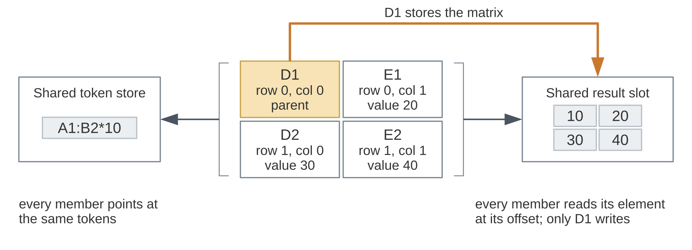

.. highlight:: cpp

.. _formula-groups:

Formula groups
==============

A formula group is a rectangular block of formula cells that share one set
of formula tokens.  This is how Ixion stores an array formula: an
expression entered once over a range, like ``{=A1:B2*10}`` in a
spreadsheet application, whose result is a matrix spread over the cells of
that range.  Each cell of the group is still an ordinary formula cell from
the outside.  You read its result the same way you read any other formula
cell, and it reports its own value, not the whole matrix.  The grouping is
about storage and calculation: one copy of the tokens, one interpretation,
one result shared by all the cells.

.. note::

   Today a formula group always stands for an array formula.  Grouping
   adjacent cells that merely happen to have the same formula, so that
   each cell is calculated at its own position, is not supported yet.

Creating a group
----------------

Let's put some values in A1:B2 and create a group over D1:E2 that
multiplies them by 10.  We'll also use a small ``dump()`` helper that
prints the sheet in verbose mode:

.. literalinclude:: ../../doc_example/formula_groups.cpp
   :language: C++
   :start-after: //!code-start: dump
   :end-before: //!code-end: dump

.. literalinclude:: ../../doc_example/formula_groups.cpp
   :language: C++
   :start-after: //!code-start: setup
   :end-before: //!code-end: setup
   :dedent: 4

The formula is parsed at the top-left cell of the group, D1, and
:cpp:func:`~ixion::model_context::set_grouped_formula_cells` takes the
range of the group along with the tokens:

.. literalinclude:: ../../doc_example/formula_groups.cpp
   :language: C++
   :start-after: //!code-start: create-group
   :end-before: //!code-end: create-group
   :dedent: 4

.. code-block:: text

    +---+-------+-------+---+------------------------+------------------------+
    |   | A     | B     | C | D                      | E                      |
    +---+-------+-------+---+------------------------+------------------------+
    | 1 | 1 [v] | 2 [v] |   | {A1:B2*10}@0/2 (#RES!) | {A1:B2*10}@0/2 (#RES!) |
    | 2 | 3 [v] | 4 [v] |   | {A1:B2*10}@1/2 (#RES!) | {A1:B2*10}@1/2 (#RES!) |
    +---+-------+-------+---+------------------------+------------------------+

All four cells show the same formula.  The braces around it mark a grouped
cell, and the ``@0/2`` part gives the cell's row offset within the group
and the number of rows in the group.  The formula is printed relative to
the top-left cell of the group for every member, which is why D2 shows
``A1:B2`` rather than ``A2:B3``.  The ``#RES!`` marker means the cell has
no result yet.

There is a second overload that takes a cached result along with the tokens,
for when you load a document that already stores the results of its array
formulas.  Just note that the result has to be a matrix with the exact
dimensions of the group, or the call throws.

Calculating a group
-------------------

A group is registered with the dependency tracker and calculated through
its top-left cell.  Registering that one cell registers the whole group,
and the calculation of that one cell fills in the results of all the
members.  We'll use a ``calculate()`` helper like the one from the
:ref:`names-and-tables` page, with the modified cells added as a
parameter since we'll need them further down:

.. literalinclude:: ../../doc_example/formula_groups.cpp
   :language: C++
   :start-after: //!code-start: calculate
   :end-before: //!code-end: calculate

.. literalinclude:: ../../doc_example/formula_groups.cpp
   :language: C++
   :start-after: //!code-start: calculate-group
   :end-before: //!code-end: calculate-group
   :dedent: 4

.. code-block:: text

    +---+-------+-------+---+---------------------+---------------------+
    |   | A     | B     | C | D                   | E                   |
    +---+-------+-------+---+---------------------+---------------------+
    | 1 | 1 [v] | 2 [v] |   | {A1:B2*10}@0/2 (10) | {A1:B2*10}@0/2 (20) |
    | 2 | 3 [v] | 4 [v] |   | {A1:B2*10}@1/2 (30) | {A1:B2*10}@1/2 (40) |
    +---+-------+-------+---+---------------------+---------------------+

Passing the whole range of the group as the set of new formula cells
works as well as passing just the top-left cell, since the group is
calculated as a unit either way.

Because the group is one listener as far as the tracker is concerned, a
change to any cell it references marks the whole group dirty.  Changing
A1 re-calculates all of D1:E2, even though only D1 ends up with a
different value:

.. literalinclude:: ../../doc_example/formula_groups.cpp
   :language: C++
   :start-after: //!code-start: modify
   :end-before: //!code-end: modify
   :dedent: 4

.. code-block:: text

    +---+-------+-------+---+---------------------+---------------------+
    |   | A     | B     | C | D                   | E                   |
    +---+-------+-------+---+---------------------+---------------------+
    | 1 | 5 [v] | 2 [v] |   | {A1:B2*10}@0/2 (50) | {A1:B2*10}@0/2 (20) |
    | 2 | 3 [v] | 4 [v] |   | {A1:B2*10}@1/2 (30) | {A1:B2*10}@1/2 (40) |
    +---+-------+-------+---+---------------------+---------------------+

Inspecting a group
------------------

Given a formula cell, :cpp:func:`~ixion::formula_cell::get_group_properties`
returns a :cpp:struct:`~ixion::formula_group_t`, which tells you whether
the cell belongs to a group, how big the group is, and an identity value
that is the same for all the cells of one group.  It can be streamed to an
output stream, which prints all of that in one go.
:cpp:func:`~ixion::formula_cell::get_parent_position` maps a cell's
position to that of the top-left cell of its group; for a cell that is not
grouped it returns the position you passed in.  This is what the sheet
walker on the :ref:`sheet-copy` page uses to tell the cell to register
from the ones to skip.  Here we go through all four cells and compare each
one against D1:

.. literalinclude:: ../../doc_example/formula_groups.cpp
   :language: C++
   :start-after: //!code-start: inspect
   :end-before: //!code-end: inspect
   :dedent: 4

.. code-block:: text

    D1: (formula_group_t: grouped=true; rows=2; columns=2; identity=0x5d7127db7ba0)
      parent is D1: true
      same tokens as D1: true
    D2: (formula_group_t: grouped=true; rows=2; columns=2; identity=0x5d7127db7ba0)
      parent is D1: true
      same tokens as D1: true
    E1: (formula_group_t: grouped=true; rows=2; columns=2; identity=0x5d7127db7ba0)
      parent is D1: true
      same tokens as D1: true
    E2: (formula_group_t: grouped=true; rows=2; columns=2; identity=0x5d7127db7ba0)
      parent is D1: true
      same tokens as D1: true

All four cells report the same identity, which makes sense since they all
belong to the same group.  The identity values are guaranteed to be
different between cells belonging to different groups in a given snapshot
in time, though different groups may reuse the same identity value in
different snapshots.

The last line of each cell's output confirms that the members share one token
store, which is the whole point of the grouping.  Here,
:cpp:func:`~ixion::formula_cell::get_tokens` returns a smart pointer to the
:cpp:class:`~ixion::formula_tokens_store` that stores cell's tokens, and
comparing two of them compares their memory addresses.  So ``true`` here means
the two cells point at the very same stored object.

Reading the results
-------------------

A grouped cell has two views of its result.
:cpp:func:`~ixion::formula_cell::get_raw_result_cache` returns the result
as stored, which for a grouped cell is the matrix shared by the whole
group.  :cpp:func:`~ixion::formula_cell::get_result_cache` returns only
the element of that matrix at the cell's position within the group, as a
single value.  Note that :cpp:class:`~ixion::model_context` never reveals
the raw result cache directly, so its cell value accessors, such as
:cpp:func:`~ixion::model_context::get_numeric_value` and
:cpp:func:`~ixion::model_context::get_formula_result`, always report
individual cell results:

.. literalinclude:: ../../doc_example/formula_groups.cpp
   :language: C++
   :start-after: //!code-start: results
   :end-before: //!code-end: results
   :dedent: 4

.. code-block:: text

    raw result: {10,20;30,40}
    E2 result: 40
    E2 value: 40

Unless you specifically want the matrix, the single-value view is the one
to use, and it's the one that makes a grouped cell indistinguishable from
a plain formula cell.

How a group is stored
---------------------

The behavior above follows from how a group is put together, and it's
worth knowing the mechanism so that the rules don't look arbitrary.

Each member of a group holds a pointer to a shared token store and a
pointer to a shared result slot, along with its own row and column offset
within the group.  The member at offset zero in both directions is the
*parent*, and the parent is the only member that ever interprets the
tokens.  It does so once, at its own position, and stores the resulting
matrix in the shared slot.  The other members never calculate anything;
when their value is requested, they look up the element of that matrix at
their own offset.  This is why registering and calculating go through the
top-left cell, why the formula prints relative to the top-left cell for
every member, and why a cached result supplied up front has to be a matrix
of the group's size.

On the dependency side, registering the parent records the range of the whole
group, D1:E2 in our example, as the listener of the referenced range A1:B2.  A
single formula cell listening on a range is the common case; here it is a
range listening on a range.  The tracker holds a single entry for the group,
and it can only mark that entry dirty as a whole.  That's why the edit to A1
above re-calculated all four cells.

         and column offsets, bracketed on the left toward one shared token
         store and on the right toward one shared result slot; D1 is
         highlighted as the parent, with its own arrow writing the result.

   What each member of the group holds.  Only the parent, D1, writes the
   result slot; the others read their element from it.

Matrix results without a group
------------------------------

A group is not the only way for a matrix to show up as a formula result.
A single, ungrouped formula cell can produce a matrix too, for instance
from an inline array:

.. literalinclude:: ../../doc_example/formula_groups.cpp
   :language: C++
   :start-after: //!code-start: inline-array
   :end-before: //!code-end: inline-array
   :dedent: 4

.. code-block:: text

    +---+-------+-------+---+---------------------+---------------------+---+------------------------------+
    |   | A     | B     | C | D                   | E                   | F | G                            |
    +---+-------+-------+---+---------------------+---------------------+---+------------------------------+
    | 1 | 5 [v] | 2 [v] |   | {A1:B2*10}@0/2 (50) | {A1:B2*10}@0/2 (20) |   | {1,2;3,4}*10 ({10,20;30,40}) |
    | 2 | 3 [v] | 4 [v] |   | {A1:B2*10}@1/2 (30) | {A1:B2*10}@1/2 (40) |   |                              |
    +---+-------+-------+---+---------------------+---------------------+---+------------------------------+
    G1 grouped: false

G1 holds the whole matrix as its result, with no braces around the formula
in the dump and no group behind it.  Whether a matrix result gets spread
over a range of cells or is contained within a single cell is a decision
left to the application that builds the model, made by choosing between
calling :cpp:func:`~ixion::model_context::set_grouped_formula_cells` and
:cpp:func:`~ixion::model_context::set_formula_cell`, respectively.

.. note::

   In practice there is rarely a reason to keep a matrix in a single cell
   like this, and spreadsheet applications generally don't.  It's shown
   in this example mainly to demonstrate that it is doable.

The complete source code of this example is available
`here <https://gitlab.com/ixion/ixion/-/blob/master/doc_example/formula_groups.cpp>`_.
