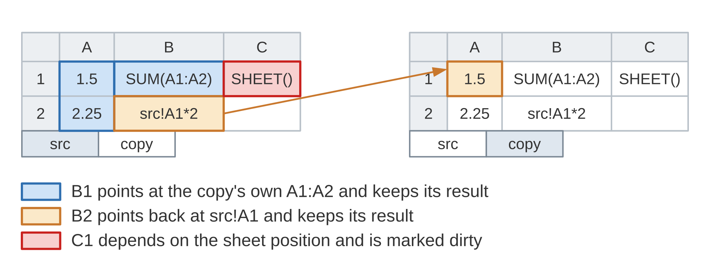
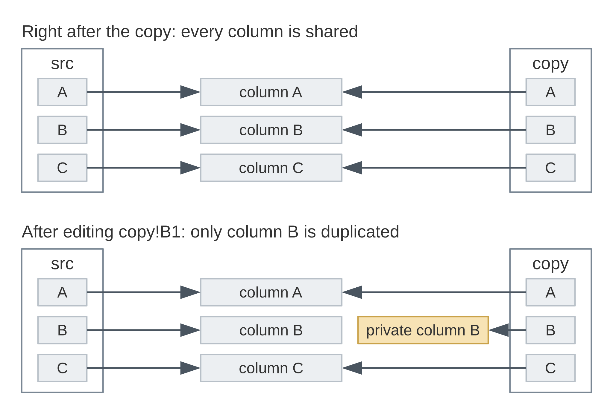

.. highlight:: cpp

.. _sheet-copy:

Copying a sheet
===============

Ixion can append a new sheet to a model as a copy of an existing one.  The
copy gets all the cells of the source sheet, including its formula cells
and their calculated results, along with the source sheet's sheet-local
named expressions and tables.  This page goes through what a copy looks
like from the outside, what you need to do afterwards, and what happens to
the cell storage underneath.

Copying with document
---------------------

The :cpp:class:`~ixion::document` class makes this a one-liner, so let's
start there.  We set up a sheet with two values and three formula cells,
each with a different kind of reference, and calculate it:

.. literalinclude:: ../../doc_example/sheet_copy.cpp
   :language: C++
   :start-after: //!code-start: doc-setup
   :end-before: //!code-end: doc-setup
   :dedent: 4

.. code-block:: text

    +---+----------+-------------------+-------------+
    |   | A        | B                 | C           |
    +---+----------+-------------------+-------------+
    | 1 | 1.5 [v]  | SUM(A1:A2) (3.75) | SHEET() (1) |
    | 2 | 2.25 [v] | A1*2 (3)          |             |
    +---+----------+-------------------+-------------+

The verbose mode of :cpp:func:`~ixion::model_context::dump_sheet` shows
each formula cell as its formula followed by the cached result in
parentheses, and marks plain values with their type.  Note that B2 prints
as ``A1*2`` here: the sheet name is left out because the reference points
at the sheet the formula is on.

Now we copy the sheet, dump the copy, calculate, and dump it again:

.. literalinclude:: ../../doc_example/sheet_copy.cpp
   :language: C++
   :start-after: //!code-start: doc-copy
   :end-before: //!code-end: doc-copy
   :dedent: 4

.. code-block:: text

    +---+----------+-------------------+-------------+
    |   | A        | B                 | C           |
    +---+----------+-------------------+-------------+
    | 1 | 1.5 [v]  | SUM(A1:A2) (3.75) | SHEET() (1) |
    | 2 | 2.25 [v] | src!A1*2 (3)      |             |
    +---+----------+-------------------+-------------+
    +---+----------+-------------------+-------------+
    |   | A        | B                 | C           |
    +---+----------+-------------------+-------------+
    | 1 | 1.5 [v]  | SUM(A1:A2) (3.75) | SHEET() (2) |
    | 2 | 2.25 [v] | src!A1*2 (3)      |             |
    +---+----------+-------------------+-------------+

The values and the formula cells came along with the copy, results
included, and the results of B1 and B2 are already correct.  B2 now prints
as ``src!A1*2``, since from the copy its reference points at another
sheet, and it still yields 3.  C1 is different: its carried-over result
says 1, the position of the source sheet, which is wrong for a cell that
now sits on the second sheet.
:cpp:func:`~ixion::document::append_sheet_copy` knows this and
marks such cells *dirty*.  Since :cpp:func:`~ixion::document::calculate`
only calculates the formula cells that are marked dirty, the next call
fixes up C1, as the second dump shows, and leaves B1 and B2 alone with the
results they came with.
Which copied cells get marked dirty is the subject of the next section.

The two sheets are independent from here on.  A change on the copy affects
only the copy's own formula cells:

.. literalinclude:: ../../doc_example/sheet_copy.cpp
   :language: C++
   :start-after: //!code-start: doc-edit-copy
   :end-before: //!code-end: doc-edit-copy
   :dedent: 4

.. code-block:: text

    copy!B1 = 102.25
    copy!B2 = 3
    src!B1  = 3.75

And a change on the source sheet reaches the source's formula cells, plus
any cell on the copy that explicitly references the source sheet:

.. literalinclude:: ../../doc_example/sheet_copy.cpp
   :language: C++
   :start-after: //!code-start: doc-edit-src
   :end-before: //!code-end: doc-edit-src
   :dedent: 4

.. code-block:: text

    src!B1  = 12.75
    src!B2  = 21
    copy!B1 = 102.25
    copy!B2 = 21

What the copy references
------------------------

The three formula cells behave differently because of how their references
are stored, as described on the :ref:`formula-syntax` page.

* ``SUM(A1:A2)`` in B1 has references with no sheet name, which are
  relative to the sheet the formula is on.  On the copy they point at the
  copy's own A1:A2.  Since those cells hold the same values as the source,
  the carried-over result is still right.

* ``src!A1*2`` in B2 has a sheet-qualified reference, which is absolute.  It
  keeps pointing at the source sheet from both copies of the formula.

* ``SHEET()`` in C1 reports the position of the sheet it's on, so its
  result can't be right on the new sheet.

That's the rule Ixion applies when deciding which copied formula cells are
*dirty* and thus need re-calculating.  A formula cell is marked dirty when
it uses a function that depends on the sheet position, like ``SHEET()``
above.  It is also marked dirty when it has a sheet-relative reference with
a non-zero offset, that is, a reference stored as "so many sheets forward
or back" from the formula's own sheet.  Such a reference can't be written
in the Excel syntaxes, where a sheet name always means an absolute sheet,
but in the Calc A1 syntax ``Sheet2.A1`` on ``Sheet1`` is exactly that: one
sheet forward.  Once the formula is copied to a new sheet at the end of the
model, one sheet forward points somewhere else entirely, so the
carried-over result is no longer trustworthy.

Formula cells whose references stay on their own sheet, or use absolute
sheet references, keep their results.  Volatile formula cells are not marked
dirty, since they get re-calculated on every run regardless.

         share one color, B2 and src!A1 share another with an arrow between
         them, and C1 is marked in red.

   What the three formula cells on the copy refer to.  Only ``C1`` needs
   re-calculating.

Copying with model_context
--------------------------

At the :cpp:class:`~ixion::model_context` level the same operation comes in
two parts, because the model context stores cells but doesn't drive
calculation.  To keep the code short, we'll reuse the two helper functions
introduced on the :ref:`names-and-tables` page: ``set_formula()``, which
parses a formula and stores it in a cell, and
``calculate()``, which calculates a given set of dirty formula cells.  With
those in place, let's build a sheet similar to the one above:

.. literalinclude:: ../../doc_example/sheet_copy.cpp
   :language: C++
   :start-after: //!code-start: cxt-setup
   :end-before: //!code-end: cxt-setup
   :dedent: 4

.. code-block:: text

    +---+----------+-------------------+-------------+
    |   | A        | B                 | C           |
    +---+----------+-------------------+-------------+
    | 1 | 1.5 [v]  | SUM(A1:A2) (3.75) | SHEET() (1) |
    | 2 | 2.25 [v] |                   |             |
    +---+----------+-------------------+-------------+

:cpp:func:`~ixion::model_context::append_sheet_copy` returns a
:cpp:struct:`~ixion::model_context::sheet_copy_result`, which holds the
index of the new sheet and the positions of the formula cells that need
re-calculating:

.. literalinclude:: ../../doc_example/sheet_copy.cpp
   :language: C++
   :start-after: //!code-start: cxt-copy
   :end-before: //!code-end: cxt-copy
   :dedent: 4

.. code-block:: text

    new sheet index: 1
    needs recalculation: (sheet:1; row:0; column:2)-(sheet:1; row:0; column:2)
    +---+----------+-------------------+-------------+
    |   | A        | B                 | C           |
    +---+----------+-------------------+-------------+
    | 1 | 1.5 [v]  | SUM(A1:A2) (3.75) | SHEET() (1) |
    | 2 | 2.25 [v] |                   |             |
    +---+----------+-------------------+-------------+

The dump of the new sheet shows everything carried over as is, including
the result of C1, which is the one cell reported for re-calculation.

The dependencies of the new sheet's formula cells are tracked as part of
the copy.  The reported cells go into a calculation as the dirty formula
cells:

.. literalinclude:: ../../doc_example/sheet_copy.cpp
   :language: C++
   :start-after: //!code-start: cxt-recalc
   :end-before: //!code-end: cxt-recalc
   :dedent: 4

.. code-block:: text

    copy!C1 = 1
    copy!C1 = 2 (after calculate)

.. note::

    Register the copied formula cells before calculating them, not after.
    Registration is what lets the calculation find the cells that depend on
    the ones being re-calculated.

Named expressions and tables
----------------------------

Sheet-local named expressions of the source sheet are copied to the new
sheet, with their origins moved along so that they print the same way from
the copy.  Global named expressions are shared by all sheets and need no
copying.

Tables are copied too.  Since table names are unique within a model, each
copy gets a new name by counting up the number at the end of the original,
so a copy of ``Table1`` becomes ``Table2`` if that name is free, ``Table3``
otherwise, and so on.  Table references in the copied formula cells are
rewritten to point at the copied tables, so a formula like
``SUM(Table1[Amount])`` on the copy reads ``SUM(Table2[Amount])`` and sums
the copy's own data.  See :ref:`names-and-tables` for both features.

Cell storage
------------

Copying a sheet doesn't duplicate its cell storage right away.  The new
sheet shares the storage of the source sheet, column by column, and a
column gets its own private copy the first time either sheet modifies it.
Copying a large sheet is therefore cheap, and the cost of the copy is paid
gradually, only for the columns that actually diverge.

         same three column blocks; after an edit to copy!B1, the copy's
         column B points at a private block while A and C stay shared.

   Column storage after a copy, and after the first edit on the copy.

This is a build-time option.  It is on by default, and can be switched off
with ``--disable-cow`` when configuring with autotools, or by turning off
the ``IXION_COW`` option in CMake, in which case a copy duplicates the
storage up front.  The behavior of the API is the same either way; only
the memory use and the time taken by the copy differ.

The complete source code of this example is available
`here <https://gitlab.com/ixion/ixion/-/blob/master/doc_example/sheet_copy.cpp>`_.
